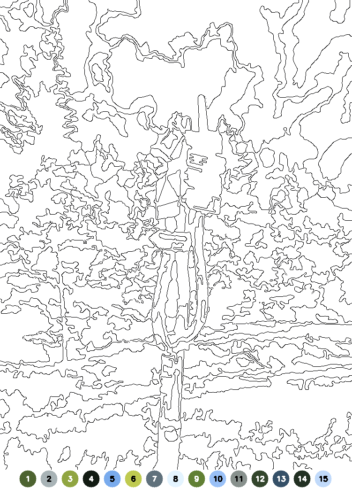

# Paint by Number Generator

This project is a Python script that can convert normal images into Paint by Number images (either filled with colors or just outlines and labels) utilizing KMeans clustering.

## Features

- Command line interface (CLI)
- Choose a color mode to cluster by (RGB, HSL, HSV, Lab, grayscale)
  and the amounts of clusters (colors in the color palette)
- Resize large images to fit a chosen size, keeping the aspect ratio, to speed up the processing
- Choose what parts of the image to generate (outlines, numbers, color fill)
- Use a seed for the clustering algorithm to get consistent results
- Supports a variety of image formats (the ones supported by OpenCV)

## Installation

### Dependencies

- **Python** 3.9 *or higher*
- **OpenCV** 4.5.2.52 *or higher*
- **Numpy** 1.19.3 *or higher*
- **Scikit-learn** 1.2.0 *or higher*

**Lower versions of the dependencies might work, but they have not been tested.**
Also tested with Python 3.10.9, OpenCV 4.8.1, Numpy 1.25.1, Scikit-learn 1.3.2.

To install the dependencies with pip (after installing an appropriate version of Python),
run the following command:

```none
pip install numpy>=1.19.3 opencv-python>=4.5.2.52 scikit-learn>=1.2.0
```

### Setup

Just download the `pbn-gen.py` file and install the dependencies.
It is then ready to be run with Python.

## Usage

```none
usage: pbn-gen.py [-h] -o OUTPUT [-r WIDTH HEIGHT] [-c {BGR,HSL,HSV,LAB,GRAYSCALE}] [-k COLOR_PALETTE_SIZE] [-m MIN_CELL_SIZE]
                  [-M MAX_CELLS] [-O] [-f] [-n] [-s SEED]
                  input [input ...]

positional arguments:
  input                 Paths of input images.

options:
  -h, --help            show this help message and exit
  -o OUTPUT, --output OUTPUT
                        Path of output image.
  -r WIDTH HEIGHT, --resize WIDTH HEIGHT
                        Resize the input image to fit within the specified size. The aspect ratio is maintained.
  -c {BGR,HSL,HSV,LAB,GRAYSCALE}, --color-mode {BGR,HSL,HSV,LAB,GRAYSCALE}
                        Color mode of the input image. Defaults to LAB.
  -k COLOR_PALETTE_SIZE, --color-palette-size COLOR_PALETTE_SIZE
                        Number of colors used in the output. Defaults to 10.
  -m MIN_CELL_SIZE, --min-cell-size MIN_CELL_SIZE
                        Minimum size of a cell in the output image in pixels Defaults to 200. If set to 0, all cells are naturally    
                        kept.
  -M MAX_CELLS, --max-cells MAX_CELLS
                        Maximum number of cells in the output image. Defaults to 250. If set to 0 or a negative number, no limit is   
                        imposed.
  -O, --no-outline      Do not have outlines in the output image.
  -f, --fill            Fill the output image with the colors.
  -n, --numbers         Have numbers in the output image. This feature is currently broken!
  -s SEED, --seed SEED  Seed for the color clustering algorithm. If not provided, a random seed is used.
```

## Examples

Input image:


Output image with outlines and color fill:


Output image with just outlines:
